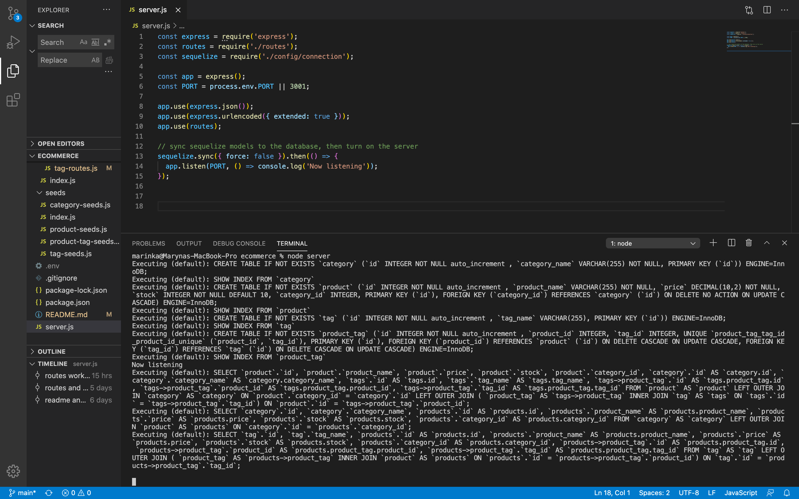

## ECOMMERCE

## Images :camera_flash:

The following image shows the web application's appearance:

## Description :page_with_curl:

This code features a back end for an e-commerce site.
With working Express.js API it configures the use of Sequelize to interact with a MySQL database.
It shows the configuration to connect a database using Sequelize.

## Technology Used :label: 

* Node.js
* Inquirer
* MySQL
* Sequilize

## Resources Used :wrench: 

* [Inquirer package](https://www.npmjs.com/package/inquirer)
* [emoji-cheat-sheet:for readme](https://github.com/ikatyang/emoji-cheat-sheet)
* [MySQL2](https://www.npmjs.com/package/mysql2) and [Sequelize](https://www.npmjs.com/package/sequelize) packages to connect Express.js API to a MySQL database 
* [Dotenv package](https://www.npmjs.com/package/dotenv) to use environment variables to store sensitive data, like MySQL username, password, and database name.

## Installation :electric_plug:

* `npm init -y`
* `npm install express sequelize mysql2`
* `npm install dotenv`
* after creating the models and routes, run `npm run seed` to seed data to your database to test the routes
* `npm start or node server` - run  at the root of your directory to connect to the server

## Testing :repeat_one:

Because this application is not deployed, the following links show the application's API routes being tested on Insomnia. 

* The first video shows GET routes to return all categories, all products, and all tags being tested in 
* The second video shows GET routes to return a single category, a single product, and a single tag being tested in 
* The third video shows the POST, PUT, and DELETE routes for categories being tested in 

* The forth video shows the POST, PUT, and DELETE routes for products being tested in 
The third video shows the POST, PUT, and DELETE routes for tags being tested in 

## Contribution :heavy_plus_sign: 

Contributions, issues and feature requests are welcome. 
Check out [issues page](https://github.com/MarynaPR/e-commerce-back-end/issues). 
Give :star: if you found this project useful. 

### Questions :question: 
Feel free to contact me with any questions via email :e-mail: pryadkamaryna@gmail.com. 
  
If you'd like to see my other projects, please visit my :octocat: 
[GitHub](https://github.com/MarynaPR?tab=repositories)
